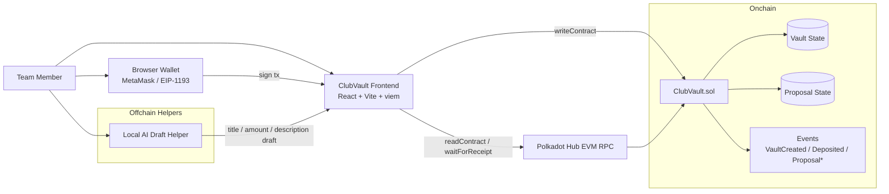

# ClubVault Architecture

- 작성일: 2026-03-09
- 목적: 해커톤 제출용 아키텍처를 한 장으로 설명

## 설명

- 프론트엔드는 `viem`으로 컨트랙트 read/write를 수행한다.
- 지갑은 서명만 담당하고, 제안 생성 보조용 AI draft는 오프체인에서만 동작한다.
- 온체인 핵심 상태는 `Vault`와 `Proposal` 두 축으로 유지된다.
- 제안 승인과 실행 결과는 이벤트와 재조회로 프론트에 반영된다.
